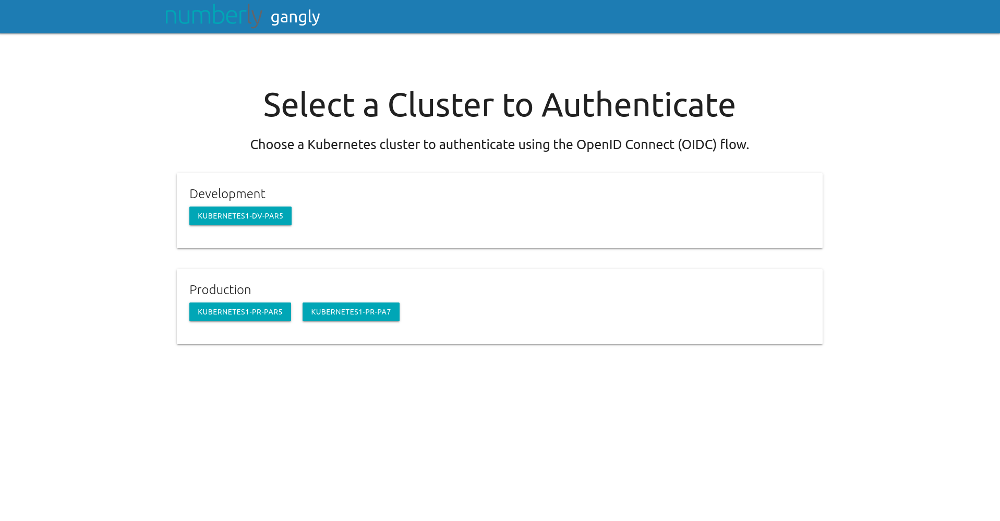

# This is a fork of Heptio Gangway! 

... which was EOL-ed by VMware. See https://github.com/vmware-archive/gangway for the original.

This fork aims to continue development of Gangway by Numberly corporation.

gangly
=======

_(noun): An opening in the bulwark of the ship to allow passengers to board or leave the ship._

An application that can be used to easily enable authentication flows via OIDC for a kubernetes cluster.
Kubernetes supports [OpenID Connect Tokens](https://kubernetes.io/docs/reference/access-authn-authz/authentication/#openid-connect-tokens) as a way to identify users who access the cluster.
Gangly has been improved and is now able to handle multiple clusters
Gangly allows users to self-configure their `kubectl` configuration in a few short steps.



Once authenticated for one of your cluster : 


## Deployment

Instructions for deploying gangly for common cloud providers can be found [here](docs/README.md).

## How It Works

Kubernetes supports OpenID Connect (OIDC) as a user authentication mechanism. OIDC is an
authentication protocol that allows servers to verify the identity of a user by way of an ID Token.

When using OIDC to authenticate with Kubernetes, the client (e.g. `kubectl`) sends the ID token
alongside all requests to the API server. On the server side, the Kubernetes API server verifies the
token to ensure it is valid and has not expired. Once verified, the API server extracts username and
group membership information from the token, and continues processing the request.

In order to obtain the ID token, the user must go through the OIDC authentication process. This is
where Gangly comes in. Gangly is a web application that enables the OIDC authentication flow which
results in the minting of the ID Token.

Gangly is configured as a client of an upstream Identity Service that speaks OIDC. To obtain the ID
token, the user accesses Gangly, initiates the OIDC flow by clicking the "Log In" button, and
completes the flow by authenticating with the upstream Identity Service. The user's credentials are
never shared with Gangly.

Once the authentication flow is complete, the user is redirected to a Gangly page that provides
instructions on how to configure `kubectl` to use the ID token.

The following sequence diagram details the authentication flow:

<p align="center">
    
</p>

## API-Server flags

gangly requires that the Kubernetes API server is configured for OIDC:

https://kubernetes.io/docs/admin/authentication/#configuring-the-api-server

```bash
kube-apiserver
...
--oidc-issuer-url="https://example.auth0.com/"
--oidc-client-id=3YM4ue8MoXgBkvCIHh00000000000
--oidc-username-claim=email
--oidc-groups-claim=groups
```

## Build

Requirements for building

- Go (built with version >= 1.21)

A Makefile is provided for building tasks. The options are as follows

Getting started is as simple as:

```bash
go get -u github.com/soulkyu/gangly
cd $GOPATH/src/github.com/soulkyu/gangly
make setup
make
```
